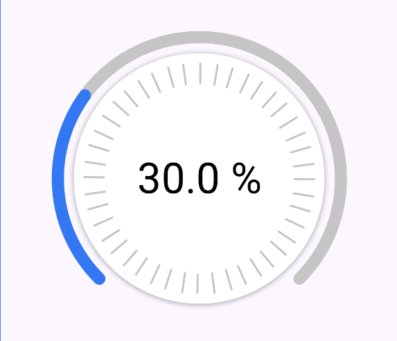

# EBot

EBot is an Android UI library providing reusable and customizable Jetpack Compose components for building modern, native Android interfaces.


## Features
- NavigationBar
- RadialSlider

## Requirements
- Android 8.0 (API 26)+
- Jetpack Compose 

## Installation

Add the dependency to you `build.gradle.kts`

``` kotlin
dependencies {
    implementation("io.github.emilioboti:ebot-ui:1.0.2")
}
```

## RadialSlider

A customizable circular slider built with Jetpack Compose. It supports
custom track width, colors, progress, and content.



```` kotlin
var progress by remember { mutableFloatStateOf(30f) }

RadialSlider(
    modifier = Modifier.size(300.dp),
    progress = progress,
    trackWidth = 12.dp,
    colors = SliderStyleDefault.sliderColor(
        progressColor = AzureBlue
    ),
    onChange = { value ->
        progress = value
    }
) {
    // YOUR CONTENT
    Text(
        text = "${progress.toInt()}%",
        style = MaterialTheme.typography.titleLarge.copy(
            fontSize = 42.sp
        )
    )
}
````


## LICENSE

This project is licensed under the MIT License. See the [LICENSE](LICENSE) file for details.


